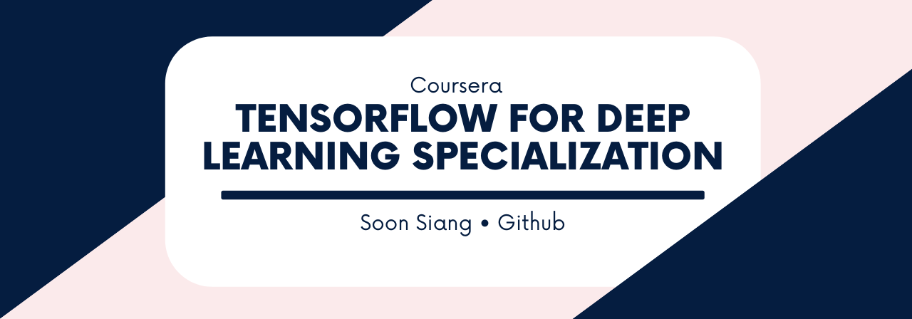

# Repository for the Introduction to Tensorflow 2 Specialization
<i>offered by Coursera</i>

 

This repository stores all jupyter notebooks and other relevant resources related to the Introduction to Tensorflow 2 Specialization on Coursera.

## Objective

This repository stores all the relevant tutorials and programming assignments related to the Specializations.

**Adherence to the Coursera's Honor Code**

- Full codes to the tutorials (typed out by myself by following the videos on the tutorials) will be made accessible to all as I believe it can help future learners to save some time by copy-pasting the codes instead of typing it out manually.
- As for the programming assignments and capstone projects for each course, PDFs of the final output will be placed on the repository but not the underlying codes. 

## Remarks on the Specialization

There are three courses under the Specialization, namely:

1. [Getting started with TensorFlow 2](https://www.coursera.org/learn/getting-started-with-tensor-flow2/home/welcome)
2. [Customising your models with TensorFlow 2](https://www.coursera.org/learn/customising-models-tensorflow2/home/welcome)
3. [Probabilistic Deep Learning with TensorFlow 2](https://www.coursera.org/learn/probabilistic-deep-learning-with-tensorflow2/home/welcome)

The Specialization (as a whole) assumes some prior knowledge on Deep Learning which one can attain via other courses offered on Coursera, such as, (the very famous) [Deep Learning Specialization](https://www.coursera.org/specializations/deep-learning?page=1).

For the third course offered under this Specialization, [Probabilistic Deep Learning with TensorFlow 2](https://www.coursera.org/learn/probabilistic-deep-learning-with-tensorflow2/home/welcome), it assumes some prior knowledge on Bayesian statistics, probabilistic programming and generative model. Below are some resources providing a primer on the necessary background needed.

- [Lecture on Generative Models](https://www.youtube.com/watch?v=5WoItGTWV54&t=2379s) - Provides an overview on Generative Models.
- [Tutorial on VAE using Keras](https://tiao.io/post/tutorial-on-variational-autoencoders-with-a-concise-keras-implementation/)  - A concise tutorial on VAE by Louis Tiao. *His blog generally contains great resources which are very relevant to the [Probabilistic Deep Learning with TensorFlow 2](https://www.coursera.org/learn/probabilistic-deep-learning-with-tensorflow2/home/welcome)'s course content.*

